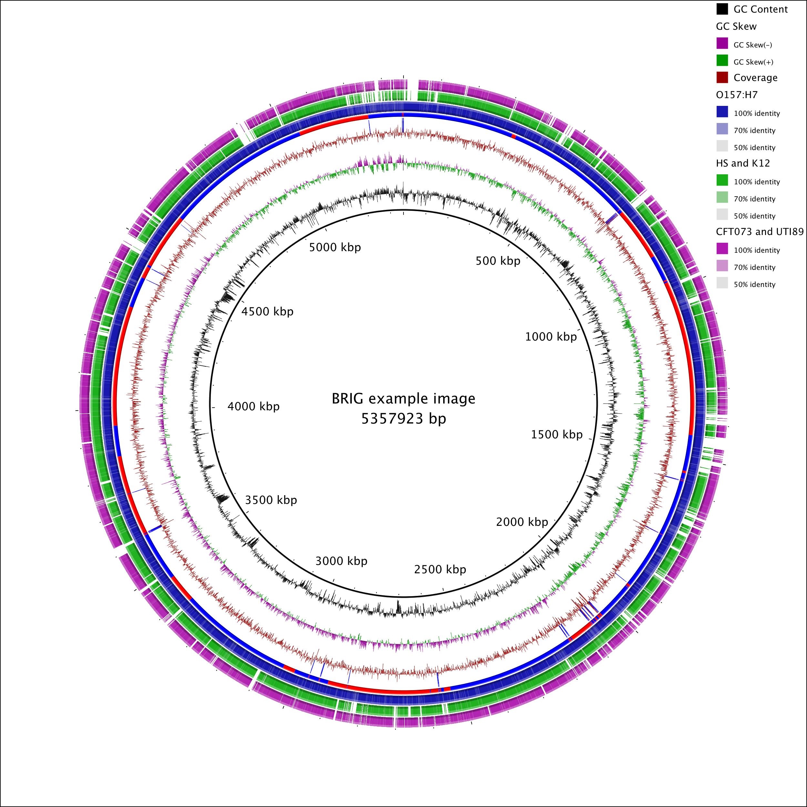

# BRIG - BLAST Ring Image Generator

[](https://github.com/happykhan/BRIG/actions/workflows/ci.yml)
[](https://www.gnu.org/licenses/gpl-3.0)
[](https://github.com/happykhan/BRIG/releases/latest)

BRIG is a cross-platform (Windows/Mac/Linux) application that displays circular comparison images of multiple genomes using BLAST. It is designed to handle genome assembly data and can show similarity, coverage, annotations and more as concentric rings around a reference sequence.



## Quick Start

### Download and run

1. Download `BRIG.jar` from the [latest release](https://github.com/happykhan/BRIG/releases/latest), or download a native installer (DMG for macOS, MSI for Windows)
2. Double-click `BRIG.jar` to launch the GUI, or run from the command line:

```bash
java -Xmx1500M -jar BRIG.jar
```

BRIG will automatically download BLAST+ if it is not found on your system.

### CLI Usage

BRIG also ships a separate CLI JAR for headless/scripted use:

```bash
java -jar brig-cli.jar <reference.fasta> <sequence_folder> --output output.png
```

See the [CLI Usage documentation](https://happykhan.github.io/BRIG/cli/) for full details and options.

## Features

- Circular comparison images with concentric rings showing BLAST similarity
- Automatic BLAST comparisons and file parsing via GUI or CLI
- Contig boundaries and read coverage display for draft genomes
- Custom graphs and annotations (GenBank, EMBL, tab-delimited)
- Gene presence/absence/truncation analysis using multi-FASTA references
- SAM file support for read-mapping comparisons
- Auto-download of BLAST+ binaries
- Native macOS and Windows installers

## Documentation

Full documentation is available at **[happykhan.github.io/BRIG](https://happykhan.github.io/BRIG/)**.

## Citation

If you use BRIG in your research, please cite:

> NF Alikhan, NK Petty, NL Ben Zakour, SA Beatson (2011) BLAST Ring Image Generator (BRIG): simple prokaryote genome comparisons. *BMC Genomics*, 12:402. doi: [10.1186/1471-2164-12-402](https://doi.org/10.1186/1471-2164-12-402)

BibTeX:
```bibtex
@article{alikhan2011brig,
  title={BLAST Ring Image Generator (BRIG): simple prokaryote genome comparisons},
  author={Alikhan, Nabil-Fareed and Petty, Nicola K and Ben Zakour, Nouri L and Beatson, Scott A},
  journal={BMC Genomics},
  volume={12},
  pages={402},
  year={2011},
  doi={10.1186/1471-2164-12-402}
}
```

## License

Copyright Nabil-Fareed Alikhan 2010-2025. Licensed under the [GNU General Public License v3.0](LICENSE).

## Contributing

Contributions are welcome! See [CONTRIBUTING.md](CONTRIBUTING.md) for details.
