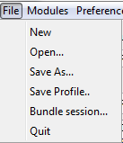
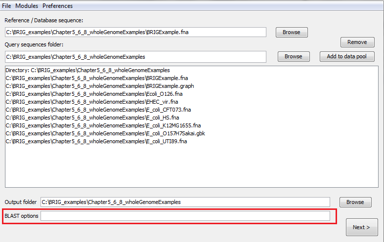
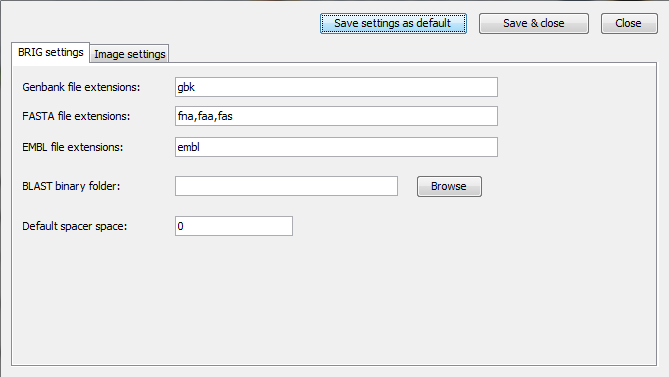
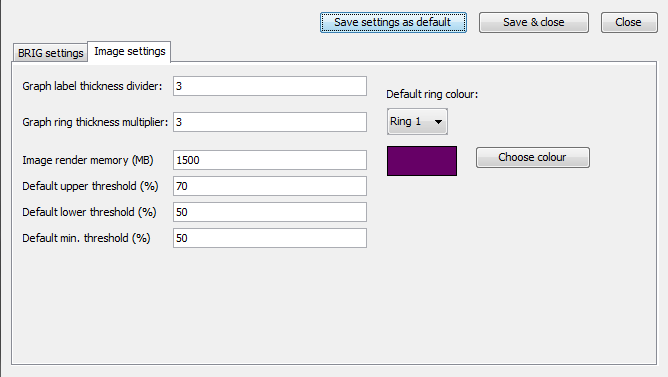
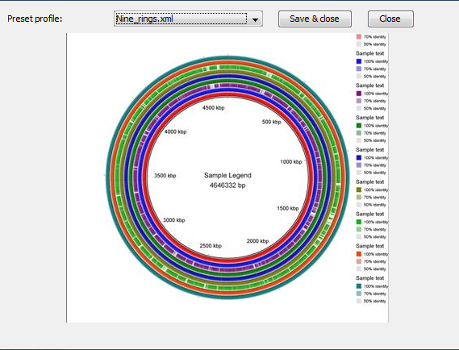

# Configuration options

## Saving and reopening your work

*Figure 15: File menu in BRIG*

Users can save their work in BRIG from the File menu (Figure 15) and can open these save files from **File menu > Open...**. There are three options for saving:

- **"Save As..."** will save all the image settings, BRIG settings, rings configuration, files users have imported into BRIG.
- **"Save Profile..."** will save just the global image settings & BRIG settings like image dimensions and font size and colours. It will not save the data pool or any ring settings. These files are designed to be used as templates for other images.
- **"Bundle Session..."** will copy all files used in the BRIG session and save all the current settings into a single directory. This directory can be compressed and kept as an archive or sent to someone else who can open the .xml file and work on the image with all of the original settings.

## BLAST options

BRIG will run with default BLAST options if the BLAST options field is left blank. BLAST options field (Figure 16) can be used to add custom BLAST options.

!!! warning "Pro Tip 16"
    BRIG handles all the file input and output into BLAST, so **DO NOT use -o, -d, -p, -i, -m in BLAST legacy or -out, -db, -query, -outfmt in BLAST+.**

The list below highlights some BLAST parameters for BLAST+; more common parameters are in bold.

*Figure 16: Set custom BLAST options on the first window (shown) or the third window*

### BLAST+ options

- **-evalue** Expectation value (E) [Real] default = 10.0
- **-dust or -seg** Filter query sequence (DUST with blastn, SEG with others) [String] default = yes
- **-task** Task to execute. Permissible values: 'blastn', 'blastn-short', 'dc-megablast', 'megablast', 'vecscreen'. Default for BLAST+ is 'megablast'. BRIG overrides this by forcing blastn, unless the user specifies otherwise.
- **-num_threads** Number of processors to use [Integer] default = 1
- -html Produce HTML output [T/F] default = F
- -gilist Restrict search of database to list of GI's [String] Optional

!!! tip "Pro Tip 17"
    BRIG runs BLAST+ with task as blastn, unless overridden by the user.

### BLAST legacy options

- **-e** Expectation value (E) [Real] default = 10.0
- **-F** Filter query sequence (DUST with blastn, SEG with others) [String] default = T
- **-a** Number of processors to use [Integer] default = 1
- -T Produce HTML output [T/F] default = F
- -l Restrict search of database to list of GI's [String] Optional
- -W Word size, default if zero (blastn 11, megablast 28, all others 3) [Integer] default = 0
- -n MegaBlast search [T/F] default = F

## Setting BRIG options

The BRIG options window under **Preferences > BRIG options** in the first main screen allows users to set options that include valid Genbank, EMBL or FASTA file name extensions; percentage identity thresholds; and memory allocated to CGView.

Changes can be applied to just the current session through "Save & Close" or changes can be saved as the default settings for every new session in BRIG through "Save settings as default". There are two BRIG option tabs.

### Tab 1: BRIG settings

*Figure 17: First BRIG options window, accessible from Preferences > BRIG options*

- **Genbank file extensions**: Users can specify the file extensions they use as GenBank files (with commas between extensions). e.g .gbk.
- **FASTA file extensions**: Users can specify the file extensions they use as FASTA files (with commas between extensions). e.g .fa,.fna,.fas.
- **EMBL file extensions**: Users can specify the file extensions they use as EMBL files (with commas between extensions). e.g .embl.
- **BLAST binary folder**: Users must specify the location of BLAST executables, leave this blank if BLAST is on their PATH.
- **Default spacer space**: Users can set a default spacer value that BRIG uses when using Multi-FASTA files.

### Tab 2: Image settings

*Figure 18: Second BRIG options window, accessible from Preferences > BRIG options*

- **Graph label thickness**: Graph rings has another smaller ring to show labelled regions, users can set how many times smaller these rings are compared to normal rings here.
- **Graph ring thickness multiplier**: Graph rings need to be larger than other rings, users can set how many times larger Graph rings are compared to normal rings here.
- **Image render memory (MB)**: Amount of memory given to CGView for image rendering, if users run out of memory when rendering their image they should increase this value.
- **Default upper & lower threshold**: The colour of BLAST matches in BRIG are shaded in a sliding scale between 100% and the lower threshold percentage identity. These values and their corresponding colour are shown in the legend. The upper threshold is used to highlight a particular percentage identity in the legend and has no bearing on the colour of BLAST matches.
- **Default min. threshold**: Minimum percent identity for BLAST results that BRIG will include on an image.

## Setting Image options

Image rendering is done through CGView, these settings can be changed from **Preferences > Image options**. A detailed explanation of these options can be found at the [CGView documentation](http://wishart.biology.ualberta.ca/cgview/xml/_cgview.html).

Here is a list of some of the more useful options:

### Global settings

- **Height and Width**: These values change the height and width of image by specifying the number of pixels.
- **Title font and color**: These values change the font type, size and colour.
- **Show shading?**: Set to false to turn off the embossing on annotations.

### Feature settings

- **FeatureSlot spacing**: Sets the amount of gaps between rings.
- **Feature thickness**: This sets the default thickness of rings on image. This can be overridden by the thickness parameter on ring customization window.

### Tick settings

- **Tick density**: This value changes how often ticks appears on the ruler, requires a decimal number between 0 and 1.
- **Long tick colour**: This value changes the colour of long (or short ticks).

### Backbone and ruler settings

- **Backbone radius**: Sets the radius size of the ring circle. Increase this to make a larger ring and decrease to make it smaller. N.B this will not automatically scale with the Image height and width.

### Label settings

- **Labels on?**: Global settings for whether feature labels should be drawn on this image.
- **Global label colour**: Default colour of labels, will be overridden with individual settings.
- **Label font**: Font of all labels, set globally.
- **Labels to keep**: Number of labels to try and keep on the image.

### Legend & Warning font settings

- **Legend and Warning font**: Font of all legend and warning messages, set globally.

## Loading a preset image template

BRIG has a set of sample templates that can be used for optimal dimensions and font sizes for a given image. This can be accessed from **Preferences > Load template**. BRIG will show a drop down of all the template in the profiles folder in the BRIG installation folder, and a preview of the template (Figure 19), from this users can choose the best template for their image and make adjustments in "Image options".

Users can add their own templates by saving a BRIG session as a profile and copying it to the profile folder in their BRIG directory. To add a thumbnail for a profile, copy a BRIG image for that session into the profile folder as a JPEG with the same name as that profile. (i.e profilename.jpg).

!!! tip "Pro Tip 18"
    Loading a preset template will not overwrite the ring colour settings. This is only to get the right proportions for image sizes, fonts and ring sizes.

*Figure 19: Loading in a preset template window*
