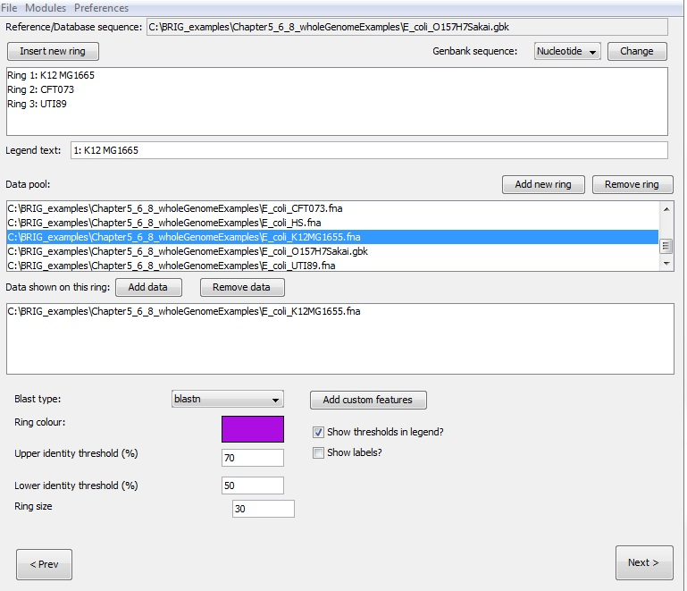
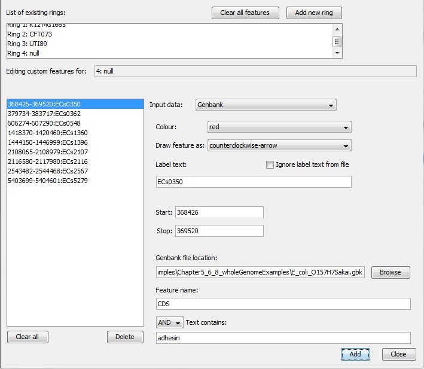
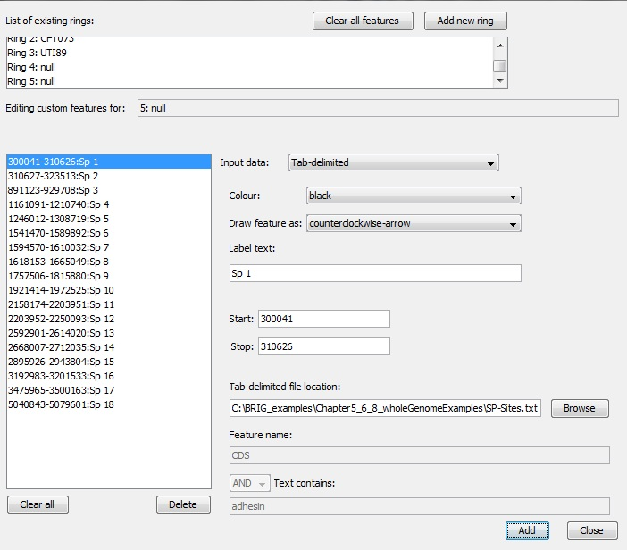
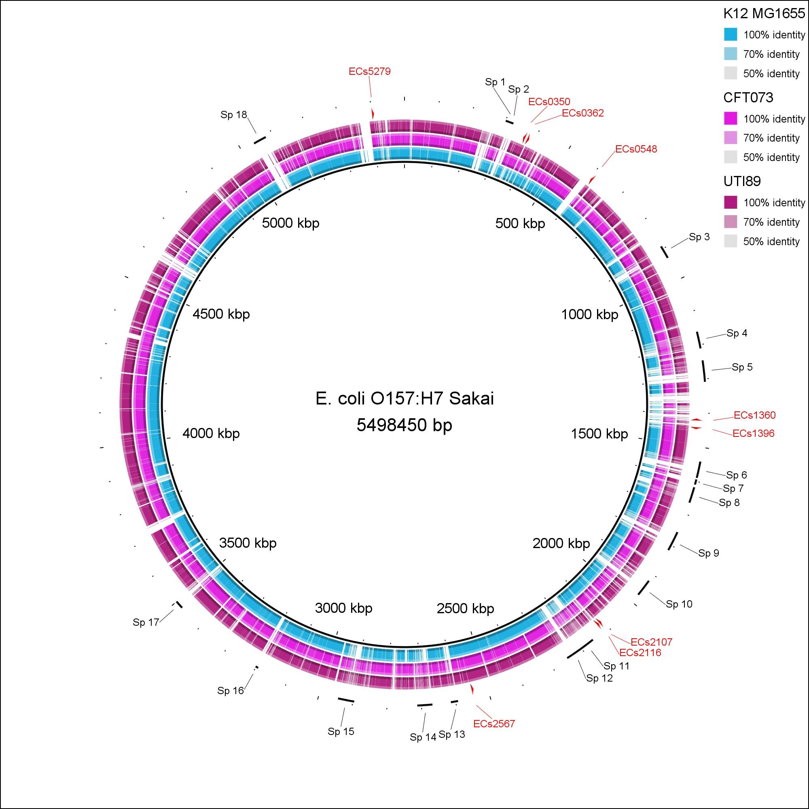
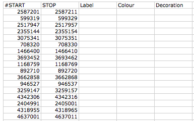

# Walkthroughs on creating custom annotations

## Adding custom annotations from a tab-delimited file, GenBank or EMBL file

BRIG can add features from a tab-delimited file, Multi-FASTA or GenBank/EMBL file. This section deals with GenBank/EMBL & tab-delimited files. A walkthrough for generating annotations from a Multi-FASTA file can be found in [Working with a Multi-FASTA reference](multi-fasta-reference.md#step-2-configure-rings-annotations-and-spacer-value).

### Step 1: Load in sequences

The walkthrough will work out of the unzipped BRIG_examples.zip folder. The walkthrough and related figures will use the Chapter5_6_8_wholeGenomeExamples folder.

1. First, set "E_coli_O157H7Sakai.gbk" as the reference sequence from the BRIGEXAMPLE folder.
2. Set the Chapter5_6_8_wholeGenomeExamples folder as the query sequence folder.
3. Press "add to data pool", this should load several items into the pool list.
4. Set the Chapter5_6_8_wholeGenomeExamples folder as the output folder.
5. The BLAST options box should be left blank.

6. Click next

### Step 2: Configure rings

The next step is to configure what information is shown on each of the concentric rings in BRIG. There should be three rings, for each ring:

1. Set the legend text for each ring
2. Select the required sequences from the data pool and click on "add data" to add to the ring list.
3. Choose a colour
4. Set the upper (70) and lower (50) identity threshold.
5. Click on "add new ring" and repeat steps for each new ring required.

The values required for each ring are detailed in the table below.

| Legend text | Required sequences | Colour |
|---|---|---|
| K12 MG1665 | E_coli_K12MG1655.fna | 0,153,255 |
| CFT073 | E_coli_CFT073.fna | 204,0,255 |
| UTI89 | E_coli_UTI89.fna | 153,0,102 |

### Step 3: Adding annotations

#### Adding annotations from GenBank files

This step adds annotations read from a GenBank/EMBL file. These files can be searched for a specific feature type containing a specific value. This walkthrough searched the *E. coli* O157:H7 Sakai genome for all CDSs that are annotated as adhesins. From the "Configure Rings" window, click "Add Custom features". These are the steps to load the GenBank features:

1. Create a new ring (Ring 4) and double-click Ring 4 in the ring list.
2. Set "input data" to GenBank.
3. Set "colour" to red.
4. Leave "Draw feature as" default.
5. Leave label text as a blank.
6. Set GenBank file location as Chapter5_6_8_wholeGenomeExamples folder / E_coli_O157H7Sakai.gbk
7. Set "Feature name" as CDS
8. Set "And" as AND
9. Set "Text contains" as adhesin.
10. Click add.
11. Remain in the "Add Custom features" for the next step.

!!! tip "Pro Tip 15"
    The same process applies for EMBL files.

By default, CDS on the sense strand will be drawn as clockwise arrows and counter-clockwise arrows for anti-sense. All other features will be shown as block arcs, by default. This can be overridden by changing "Draw feature as" from "default".

#### Adding annotations from Tab-delimited files

This step adds annotations of the *E. coli* O157:H7 Sakai prophage site (SP Sites) on to the image, which will be read from a tab-delimited file (SP-Sites.txt, which can be found in the Chapter5_6_8_wholeGenomeExamples folder).

To add annotate the image with the SP-Sites:

1. Create a new ring (Ring 5) and double-click Ring 5 in the ring list.
2. Set "input data" as Tab-delimited.
3. Leave "label" blank.
4. Set "colour" to black.
5. Set tab-delimited file location as Chapter5_6_8_wholeGenomeExamples/Sp-Sites.txt
6. Press Add.

If there are a lot of entries, this may take a few seconds. All the values should show up in the left hand pane. Individual changes can be made by double clicking and editing an entry. Users can load any kind of results or annotations into BRIG using this approach.

### Step 4: Review and submit

The last window allows us to change the BLAST options, the location of the image file and set the image title, which will appear in the centre of the ring. For the walkthrough we need to configure the third window as:

1. Set the image title as "E. coli O157:H7 Sakai".
2. Press submit.
3. The image will be created in the specified output directory and should look something like Figure 14.

*Figure 14: Output image from tab-delimited annotations. This figure shows E. coli O157:H7 Sakai as the central reference sequence, with genome comparisons to K12, CFT073 and UTI89 and the SP sites annotated in black.*

## How to create tab-delimited files for BRIG

BRIG can load custom annotations or results from a tab-delimited file. A tab delimited file is a plain text file that represents a table, with a tab between each column in the text. Rows are on each line and columns are separated by a tab character (called the delimiter). BRIG only supports tab-delimited files, not other delimiters e.g commas, space etc.

For BRIG to accept custom annotation files, it must fulfill the following requirements:

- Lines that contain column headers, or comments must start with a "#".
- The first two columns MUST be Start and Stop values and they must have a value or BRIG will ignore them.
- Specifying Labels, colours or decoration is not necessary but if they must be in the right column. (Label must be 3rd, Colour must be 4th, Decoration must be 5th).
- Acceptable Colour values are: default, red, aqua, black, blue, fuchsia, gray, green, lime, maroon, navy, olive, orange, purple, silver, teal, white, yellow.
- Acceptable Decoration values are default, arc, hidden, counterclockwise-arrow, clockwise-arrow.
- Files must be in plain-text tab-delimited.

The easiest way to make BRIG tab-delimited files is to set up a spreadsheet with exactly the same headers as below (Order and text is important) and then fill in the columns with data, leave the field blank to use default colours and decorations. Leave the label field blank if no label is required.

