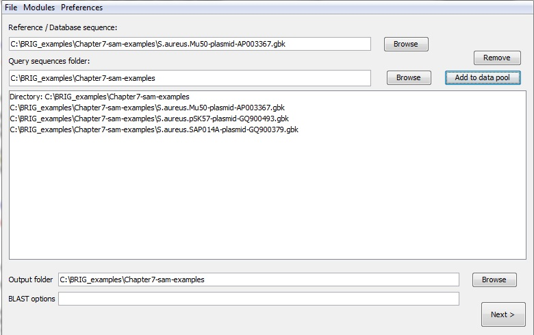
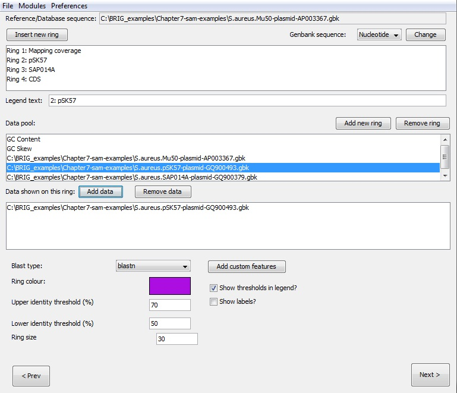
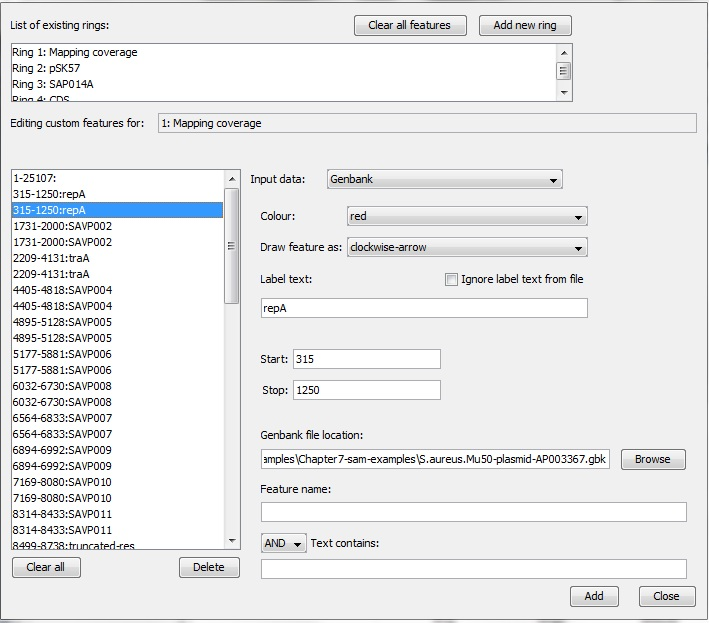
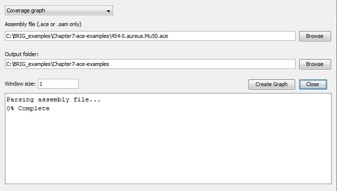
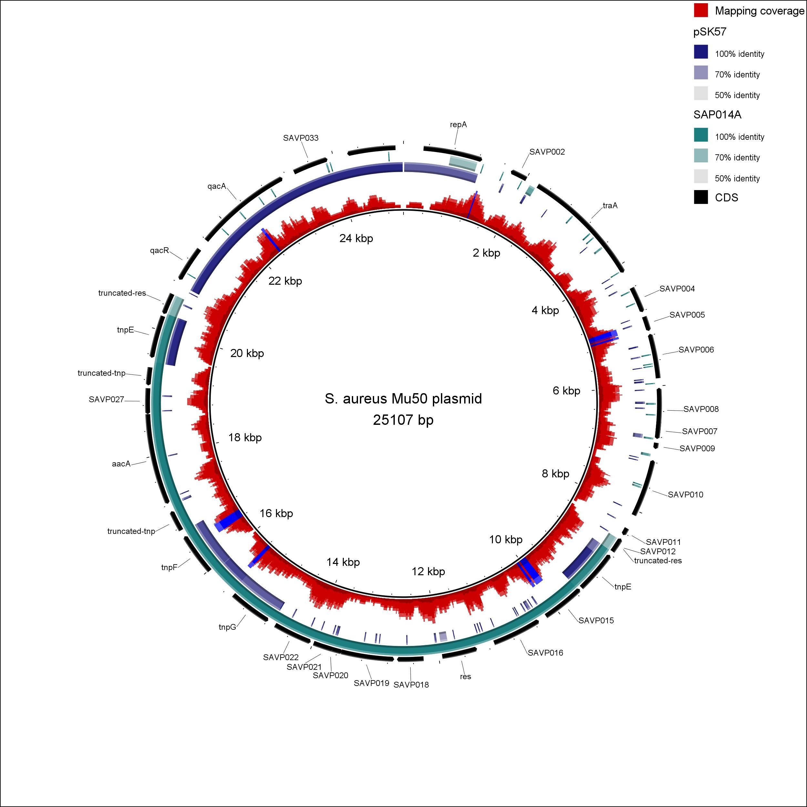
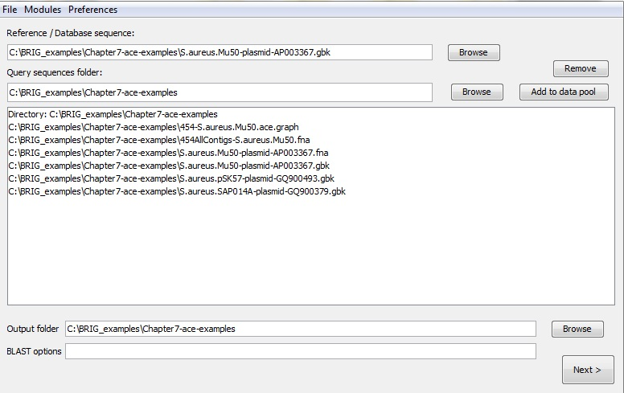
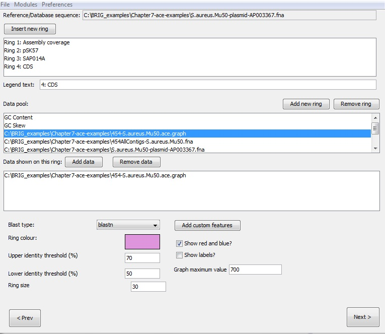
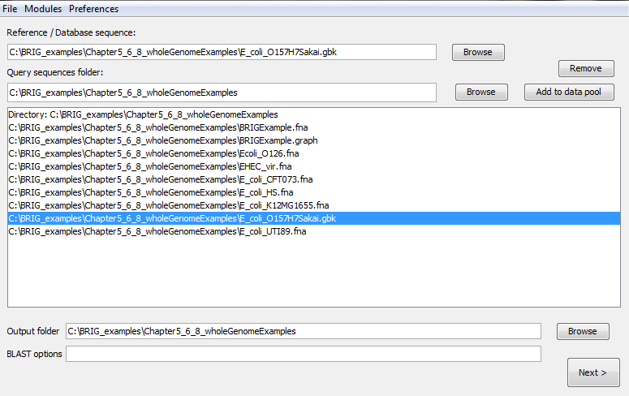
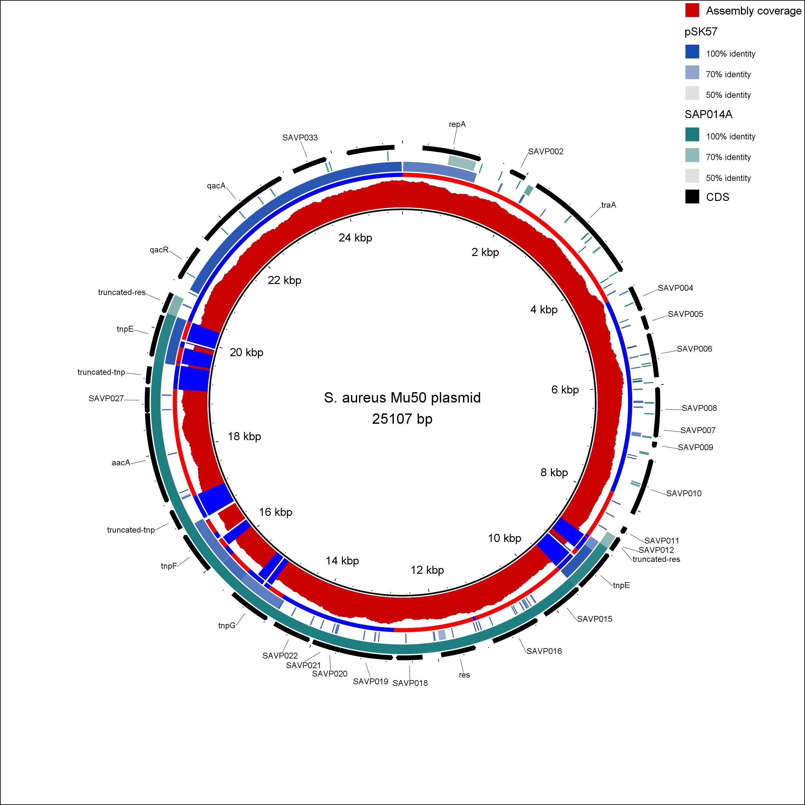

# Visualising graphs and genome assemblies

BRIG can produce any user-specified graph e.g coverage, read mapping, expression data etc. For example, the coverage graph in Figure 2 was produced from a tab-delimited text file, with a start, stop and value for that range.

BRIG supports .ace files (produced by Newbler, 454/Roche's proprietary assembler, and used by PHRAP/Consed) or SAM files (used for read mapping and some de-novo assemblers). BRIG has a number of modules for handling assembly information. These tools are:

- **Contig mapping**: BRIG will use BLAST to try and map contigs from an .ace or Multi-FASTA file onto a reference genome and produce a .graph file that can show frequency of BLAST hits and the best BLAST hit position of contigs. It will then produce a .graph file of the frequency of BLAST hits and the best BLAST hit position of contigs and another .graph file, with the suffix "rep.graph" showing all the other BLAST hits.

- **Coverage graph**: BRIG requires an .ace or .sam file and an output location. BRIG will calculate coverage values over a user-defined window and produce a .graph file in the output folder. This will create a tab-delimited .graph file, which can be loaded into back BRIG.

- **Convert graph**: A draft genome is usually modified post assembly; adding spacers, reordering contigs, etc. These changes are often not reflected in the original .ace files BRIG uses to generate coverage graphs. BRIG can use BLAST to align the original assembly output with the newer sequence and map the coverage information to the new sequence. BRIG requires:
    - Original 454AllContigs.fna produced by Newbler.
    - Graph file created by BRIG's "Coverage graph" module, based on Newbler's ace file.
    - The modified sequence or another suitable reference genome.

    BRIG will produce a new .graph file in the output folder, using the filename of the original file, with "new.graph" appended to the end.

To create work with graph files: **Main window > Modules > Create graph files**

### Using graph files in BRIG images

.graph files should be visible when users load a directory into the query sequence pool. Graphs can be treated like any other sequence file in BRIG; the example from Figure 7.1 shows a graph file loaded into the first ring of a particular BRIG session.

!!! tip "Pro Tip 14"
    Graph files cannot be shown on same ring as sequence files (protein or nucleotide).

## Walkthrough for visualising SAM file mapping coverage

This section will give a worked example of producing a BRIG image showing mapping reads coverage from a SAM input file. The final image will look like Figure 12. This walkthrough requires BRIG_examples.zip from the [BRIG GitHub releases](https://github.com/happykhan/BRIG/releases). Unzip this somewhere convenient. The general procedure is to first generate the graph files from the SAM file, add additional files to data pool, edit the rings and annotation, then render the image.

1. Open a new BRIG session.

2. Create the graph file from the graph files modules: **Main window > Modules > Create graph files**.
    1. Set drop down to coverage graph, fill in fields.
    2. Set Assembly file as "Mu50.sam" from the BRIG_examples/Chapter7-sam-examples folder.
    3. Set Output folder as the location of the Chapter7-sam-examples folder.
    4. Window size as "1".
    5. Click Create Graph. This will add the graph file to the data pool when it has finished.

    

Close the coverage graph window and return to the first main window.

1. Set reference file as "S.aureus.Mu50-plasmid-AP003367.gbk" from the Chapter7-sam-examples folder. Users can use the browse button to traverse the file system.
2. Set the Chapter7-sam-examples folder as the query sequence folder.
3. Press "add to data pool", this should load several items into the pool list.
4. Set the output folder as unzipped Chapter7-sam-examples folder.
5. Make sure the BLAST options box is blank.

Click next to move to the next window to configure the rings and add in annotations.

1. Create 4 rings, name them "Mapping Coverage", "pSK57", "SAP014A", "CDS".

2. Ring 1 Settings:
    1. Add "Mu50.sam.graph" from data pool to Ring 1.
    2. Set graph maximum value as "10".
    3. Set colour as rgb(204,0,0).
    4. Set legend title as "Mapping coverage".
    5. Check show red/blue.

3. Ring 2 Settings:
    1. Add "S.aureus.pSK57-plasmid-GQ900493.gbk" from data pool to Ring 2.
    2. Set colour as rgb(0,0,102).
    3. Set legend title as "pSK57".

4. Ring 3 Settings:
    1. Add "S.aureus.SAP014A-plasmid-GQ900379" from data pool to Ring 3.
    2. Set colour as rgb(102,0,102).
    3. Set legend title as "SAP014A".

5. Ring 4 Settings:
    1. Set colour as rgb(0,0,0).
    2. Set legend title as "CDS".

Click "Add Custom features".

1. Double-click Ring 4.
2. Set Input data to "Genbank".
3. Set colour to "black".
4. Set Draw feature as "default".
5. Set Genbank file location to the location of "S.aureus.Mu50-plasmid-AP003367.gbk".
6. Set Feature as "CDS"
7. Click add.

This will load all the coding sequences from the Genbank file. These annotations will be drawn as arrows, indicating orientation. Close this window and click next on the second window.

1. Set title as "S. aureus Mu50 plasmid".
2. Click Submit.

This will generate the final image, it should look like Figure 12.

*Figure 12: S. aureus Mu 50 plasmid, showing read mapping from simulated 454 reads, CDSs, and genome comparisons to other S. aureus plasmids, pSK57 & SAP014A. Alignments were performed with BLAST+.*

## Walk through for visualising ace file assembly coverage

This section will give a worked example of producing a BRIG image showing assembly coverage read from an ace file. The final image will look like Figure 13. This walk through requires BRIG_examples.zip from the [BRIG GitHub releases](https://github.com/happykhan/BRIG/releases). Unzip this somewhere convenient.

The general procedure is to first generate the graph files from the ace file, convert the coverage information to reference sequence if necessary, add additional files to data pool, edit rings and annotation, then render the image.

Draft genome sequences are often modified to be consistent with other information (e.g genome scaffolding, PCR sequencing of gaps) after being initially assembled. This may change the order and size of the final genome sequence compared to the original assembly.

To show the read coverage from the assembly on the final sequence correctly the "Convert graph" module within BRIG can be used to map the coverage information from the ace file onto the new sequence.

This module can also be used to map read coverage from an assembly onto a closely-related reference genome.

First, produce the coverage graph file based off the assembly (ace file):

1. Open a new BRIG session.
2. Create the graph file from the graph files module: **Main window > Modules > Create graph files**.
3. Set drop down to coverage graph, fill in fields.
    1. Set Assembly file as "454-S.aureus.Mu30.ace" from the BRIGEXAMPLE2-ace folder.
    2. Set Output folder as the location of the BRIGEXAMPLE2-ace folder.
    3. Set window size as "1".
4. Click "Create Graph". This will add the graph file to the data pool when it has finished.

Next, map the coverage generated in the previous graph file to the modified genome sequence.

1. Remain in the "Create custom graph" window: **Main window > Modules > Create graph files**.
2. Set drop down to convert graph, fill in fields as below.
    1. Set Original sequence as "454AllContigs-S.aureus.Mu50.fna".
    2. Set New sequence as "S.aureus.Mu50-plasmid-AP003367.fna".
    3. Set graph file as "454-S.aureus.Mu50.ace.graph".
    4. Set Output folder as the location of the BRIGEXAMPLE2-ace folder.
    5. Window size as "1".
3. Click "Create Graph". This will add the graph file to the data pool when it has finished.

Close the "Create custom graph" window and return to the main window.

1. Set reference file as "S.aureus.Mu50-plasmid-AP003367.gbk" from the BRIGEXAMPLE2-ace folder. Users can use the browse button to traverse the file system.
2. Set the BRIGEXAMPLE2-ace/genomes folder as the query sequence folder.
3. Press "add to data pool", this should load several items into the pool list.
4. Set the output folder as unzipped BRIGEXAMPLE2-ace folder.
5. Make sure the BLAST options box is blank.

Click next to move to the next window and configure the rings.

1. Create 4 rings.
2. Ring 1 Settings:
    1. Add "454AllContigs-S.aureus.Mu50.fnanew.graph" to Ring 1.
    2. Set colour as rgb(204,0,0).
    3. Set legend title as "Assembly coverage".
    4. Set graph maximum value as "700".
    5. Check show red/blue.
3. Ring 2 Settings:
    1. Add "S.aureus.pSK57-plasmid-GQ900493.gbk" to Ring 2.
    2. Set colour as rgb(0,0,102).
    3. Set legend title as "pSK57".
4. Ring 3 Settings:
    1. Add "S.aureus.SAP014A-plasmid-GQ900379" to Ring 3.
    2. Set colour as rgb(102,0,102).
    3. Set legend title as "SAP014A".
5. Ring 4 Settings:
    1. Set colour as rgb(0,0,0).
    2. Set legend title as "CDS".

The rings are now set up with the correct colour, data and labels. The next step is to mark the CDS on Ring 4 as "custom features". Click "Add Custom features" to open a new window.

1. Double-click on Ring 4.
2. Set Input data to "Genbank".
3. Set colour to "black".
4. Set Draw feature as "default".
5. Set GenBank file location to "S.aureus.Mu50-plasmid-AP003367.gbk" in the BRIGEXAMPLE2-ace folder.
6. Set Feature as "CDS"
7. Click add.

This will load all the coding sequences from the GenBank file. These annotations will be drawn as clockwise or counter-clockwise arrows, indicating orientation. Close this window and click next on the main window. From the third/confirmation window:

1. Set title as "S. aureus Mu50 plasmid".
2. Click submit.

This will generate the final image, which should look like Figure 13.

*Figure 13: S. aureus Mu 50 plasmid published genome sequence, showing assembly coverage from a draft assembly based on simulated 454 reads. The image also shows CDS, and genome comparisons to other S. aureus plasmids, pSK57 & SAP014A. Alignments were performed with BLAST+.*
