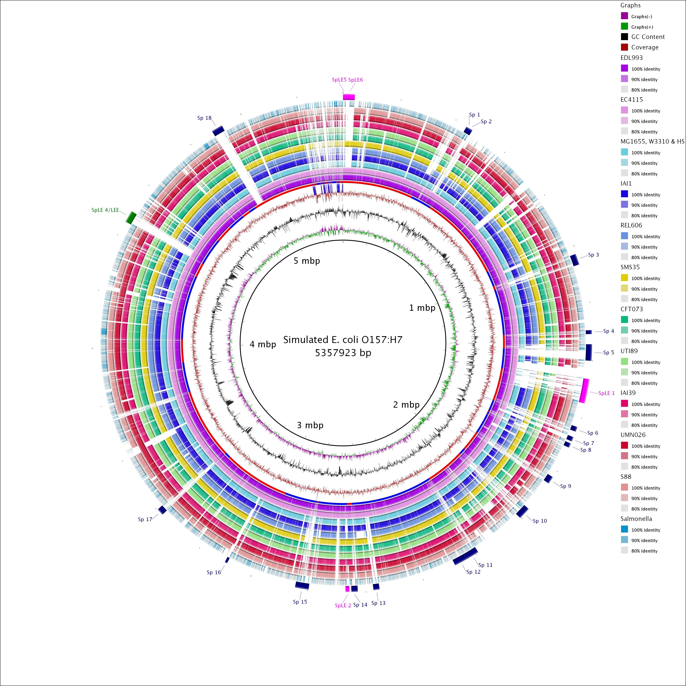
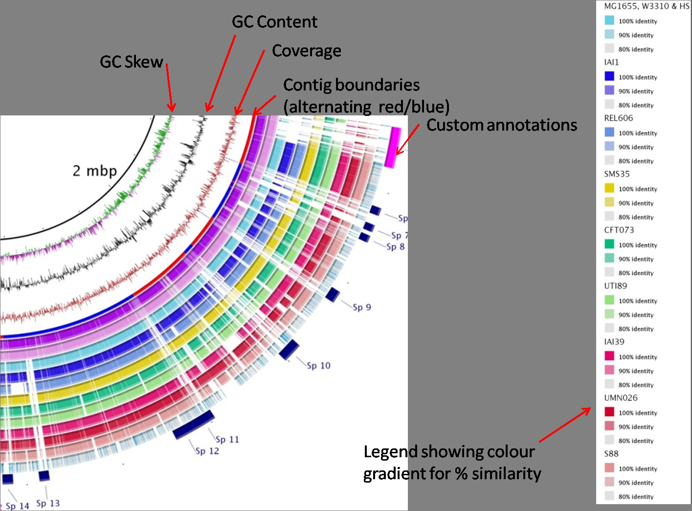
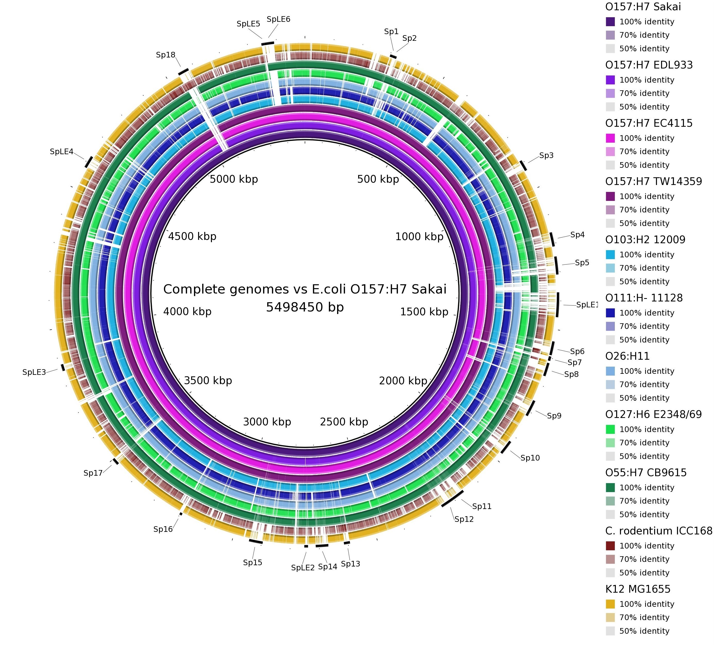
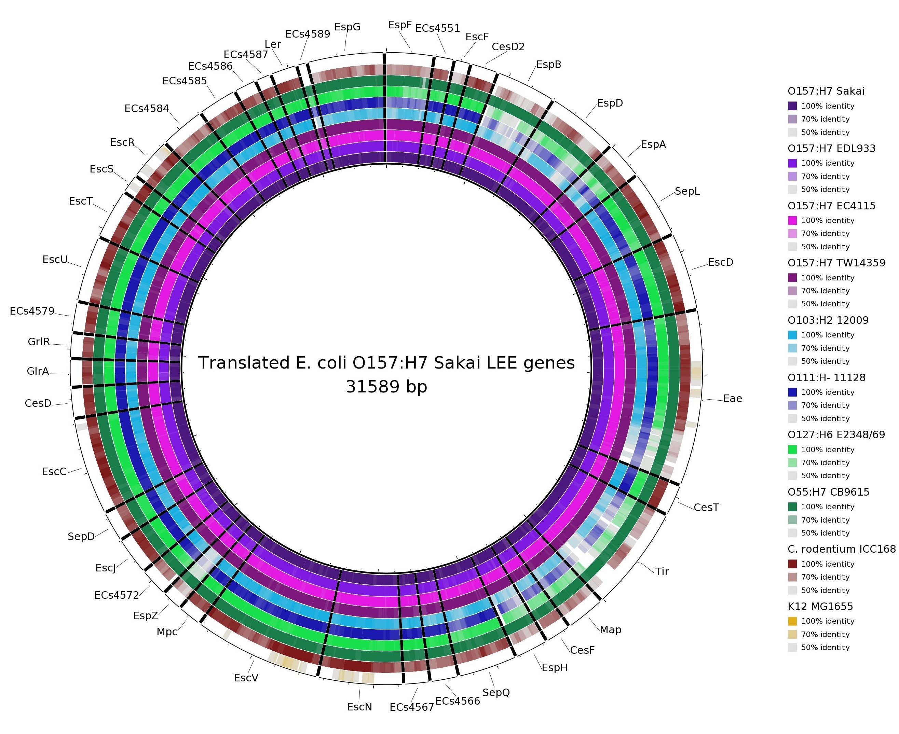
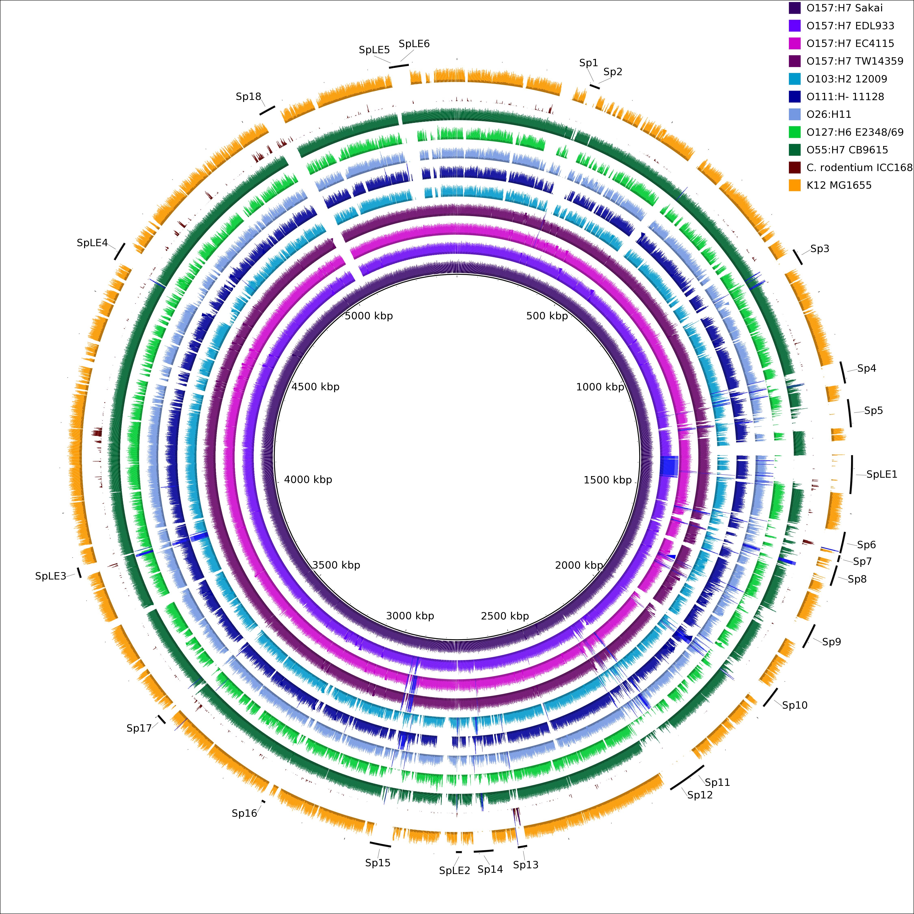

# BRIG - BLAST Ring Image Generator

BRIG is a cross-platform desktop application for generating circular comparison images of genomes. It uses [CGView](http://wishart.biology.ualberta.ca/cgview/) for image rendering and the Basic Local Alignment Search Tool (BLAST) for genome comparisons. BRIG has a graphical user interface programmed on the Swing framework, which takes the user step-by-step through the configuration of a circular image generation.

*Figure 1: BRIG example output image of a simulated draft E. coli O157:H7 genome. The figure shows BLAST comparisons against 28 published E. coli and Salmonella genomes against the simulated draft genome.*

The image below shows a magnified view of the same example image, showing similarity between a central reference genome in the centre against other query sequences as a set of concentric rings, where colour indicates a BLAST match of a particular percentage identity. BRIG does not represent sequences that are not present in the reference genome. The image shows:

- GC skew
- GC content
- Genome coverage and contig boundaries (calculated from an assembly file)
- Genome alignment results, custom annotations

*Figure 2: A magnified view of BRIG example image*

## How to use this manual

This manual contains a set of detailed walkthroughs where readers are taken step by step through a worked example. Each walkthrough highlights different features of BRIG and users should work through each one. If you are interested in a particular aspect of BRIG, please turn to the relevant walkthrough:

- **Whole genome comparisons**, including how to load in coverage graphs - see [Whole Genome Comparisons](whole-genome-comparisons.md)
- **Using a user-defined list of genes as a reference** (in Multi-FASTA) - see [Multi-FASTA Reference](multi-fasta-reference.md)
- **Creating and visualising graphs** generated from assembly (.ace) or read mapping (.SAM) - see [Graphs and Assemblies](graphs-and-assemblies.md)
- **Labelling images** with information from GenBank, Tab-delimited or Multi-FASTA files - see [Custom Annotations](custom-annotations.md)

The manual also has detailed instructions for how to install and configure BRIG:

- For instructions on how to install BRIG, see [Installation](installation.md)
- For instructions on how to configure BRIG and save BRIG settings, see [Configuration](configuration.md)

## Gallery

*Figure 3: **Reference:** Published E.coli O157:H7 Sakai genome. **Query:** Complete genome sequences of related strains, listed in the key. The prophage regions from the Sakai genome are marked in alternating black & blue. To make an image like this please refer to [Whole Genome Comparisons](whole-genome-comparisons.md).*

*Figure 4: **Reference:** A list of translated genes that make up the Locus of Enterocyte Effacement (LEE), which encodes a Type III secretion system. **Query:** Raw sequencing reads simulated from several complete LEE+ published genomes (nucleotide sequence) and E. coli K12, (negative control; LEE-). You can clearly see gene presence/absence, and divergence (the colour represents sequence identity on a sliding scale, the greyer it gets; the lower the percentage identity). To make an image like this please refer to [Multi-FASTA Reference](multi-fasta-reference.md).*

*Figure 5: **Reference:** Published E.coli O157:H7 Sakai genome. **Query:** Read mapping coverage of sequencing reads simulated from complete genomes, indicated in the key. Simulated sequencing reads were mapped onto the published complete Sakai genome using BWA. The read coverage for each genome was generated from the resulting SAM files. Compare this with Figure 3, which is based on the original published genome sequences. To make an image like this please refer to [Graphs and Assemblies](graphs-and-assemblies.md).*
