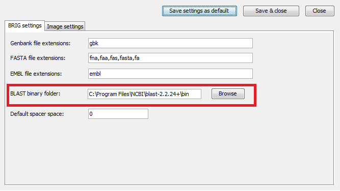

# Installation

There's no real "Installation" process for BRIG itself. However, BLAST+ must be available and BRIG needs to be able to locate the BLAST executables (See [Installing BLAST](#installing-blast) below).

!!! tip "Auto-download"
    BRIG will automatically download and install BLAST+ if it is not found on your system. See below for manual installation if needed.

To run BRIG users need to:

1. Download the latest version (BRIG-x.xx-dist.zip) from the [releases page](https://github.com/happykhan/BRIG/releases)
2. Unzip BRIG-x.xx-dist.zip to a desired location
3. Run BRIG.jar, by double clicking

Users who wish to run BRIG from the command-line need to:

1. Navigate to the unpacked BRIG folder in a command-line interface (terminal, console, command prompt)
2. Run `java -Xmx1500M -jar BRIG.jar`. Where `-Xmx` specifies the amount of memory allocated to BRIG.

## Installing BLAST

The latest version of BLAST+ can be downloaded from:
[https://ftp.ncbi.nlm.nih.gov/blast/executables/blast+/LATEST/](https://ftp.ncbi.nlm.nih.gov/blast/executables/blast+/LATEST/)

BLAST+ offers a number of improvements on the original BLAST implementation and comes as a bundled installer, which will walk users through the installation process. Please read the published paper on BLAST+:

> Camacho, C., G. Coulouris, *et al.* (2009). "BLAST+: architecture and applications." *BMC Bioinformatics* **10**(1): 421. Available online at: [http://www.biomedcentral.com/1471-2105/10/421](http://www.biomedcentral.com/1471-2105/10/421)

BLAST+ comes as a compressed package, which will unzip the BLAST binaries where ever the package is. We advise users to first create a BLAST directory (in either the home or applications directory), copy the downloaded BLAST package to that directory and unzip the package.

Users can specify the location of their BLAST installation in the BRIG options menu which is:

**Main window > Preferences > BRIG options.**

The window is shown in Figure 6. If BRIG cannot find BLAST it will attempt to download it automatically.

*Figure 6: You can change where BRIG looks for BLAST in the BRIG options window. For more information about BRIG options see [Setting BRIG Options](configuration.md#setting-brig-options).*

!!! warning
    BRIG uses BLAST, do not use wwwblast or netblast with BRIG.

!!! tip
    If BOTH BLAST+ and legacy versions are in the same location, BRIG will prefer BLAST+.
