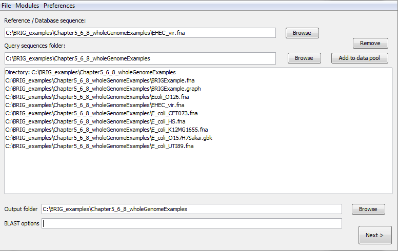
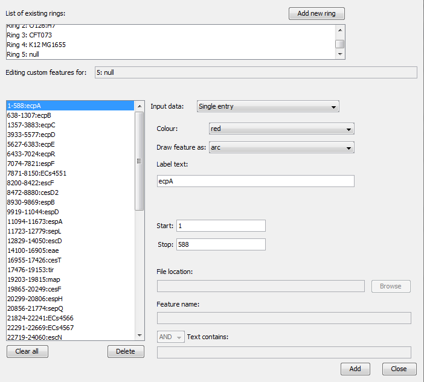
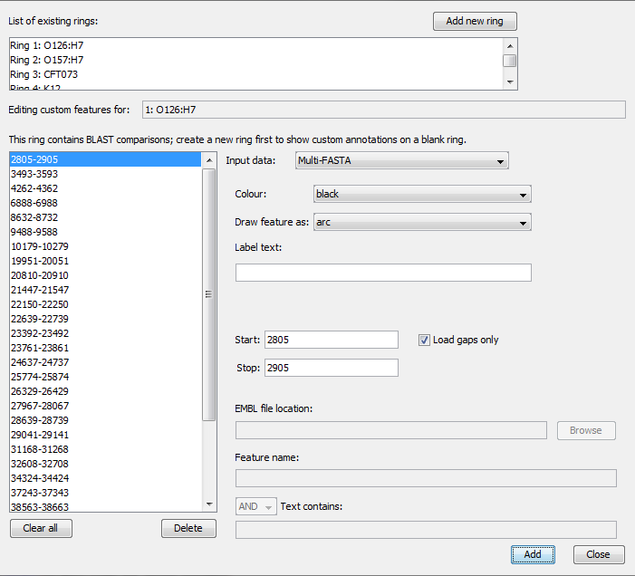
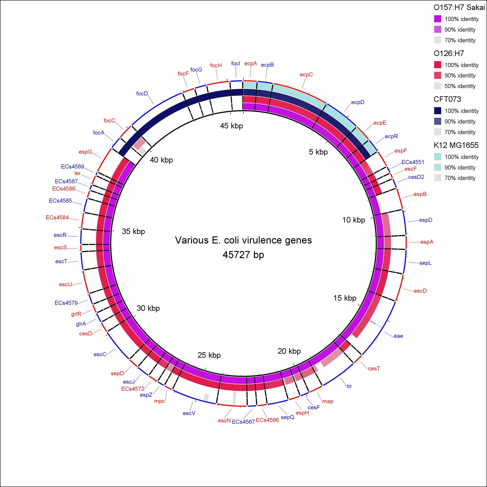
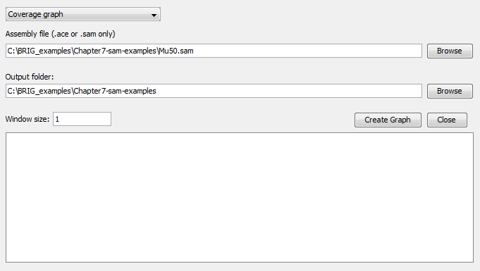

# Working with a Multi-FASTA reference

## Step 1: Load in sequences

This section is a walkthrough of how to use BRIG to generate an image using a list of genes in Multi-FASTA format as a reference. The multi-FASTA file in this example is a number of virulence genes from enterohemorrhagic and uropathogenic *E. coli*, which includes EHEC polar fimbriae (*ecpA* to *ecpR*), EHEC Locus of Enterocyte Effacement (*espF* to *espG*) and the UPEC F1C Fimbriae (*focA* to *focI*), which will be compared against the whole genome sequences of *E. coli* strains O157:H7 Sakai, K12 MG1655, O126:H7 and CFT073. Start a new session in BRIG and load in the files from the Chapter5_6_8_wholeGenomeExamples folder in the unzipped BRIG-Example folder:

1. Set the reference sequence as "EHEC_vir.fna". Users can use the browse button to traverse the file system.
2. Set the Chapter5_6_8_wholeGenomeExamples folder as the query sequence folder.
3. Press "add to data pool", this should load several items into the pool list.
4. Set the output folder as unzipped BRIG-Example folder.
5. Make sure the BLAST options box is blank.

6. Click "Next".

## Step 2: Configure rings, annotations and spacer value

The next step is to configure what information is shown on each concentric ring in BRIG. Figure 8 is an example of how one of the windows should be set up. There should be five rings. Do the following for each ring, according to the table below:

1. Set legend text for each ring.
2. Select the required sequences from the data pool and click "add data" to add.
3. Choose a colour
4. Set upper (90) and lower (70) identity thresholds.
5. Click "add new ring" and repeat these steps for each new ring.

| Legend text | Required sequences | Colour |
|---|---|---|
| O157:H7 | E_coli_O157H7Sakai.gbk | 172,14,225 |
| O126:H7 | E_coli_O126.fna | 255,0,51 |
| CFT073 | E_coli_CFT073.fna | 0,0,102 |
| K12 | E_coli_K12MG1655.fna | 161,221,231 |
| null | none | ignore |

After each ring is configured, users need to make the following changes:

1. Set the spacer field to 50 base pairs.
2. Set the ring size of ring 5 as "2".

*Figure 8: Ring set-up for Multi-FASTA file*

!!! tip "Pro Tip 11"
    The Spacer field determines the number of base pairs to leave between FASTA sequences.

The next step is to add the gene annotations, which will be fetched from the Multi-FASTA headers:

1. Click Add custom features in the second BRIG window to bring up custom annotation window (Figure 9).
2. Double click "Ring 5".
3. Set "input data" as Multi-FASTA.
4. Set "colour" as alternating red-blue
5. Click add.

*Figure 9: Custom annotation window - adding gene annotations*

This step colours the gaps between FASTA entries, the gaps are calculated from the Multi-FASTA file (Figure 10). For each genome ring, do the following:

1. Set "input data" as Multi-FASTA.
2. Set "colour" as black
3. Check "load gaps only".
4. Click add.

The results should be similar to Figure 10 in the left hand pane. Close the window when this is done.

*Figure 10: Custom annotation window - adding spacers*

!!! tip "Pro Tip 12"
    A spacer value can be set when using protein sequences from a GenBank/EMBL file.

## Step 3: Configure image settings and submit

There are a few more steps to complete and then the image is finished. In the customize ring window:

1. Make the following changes in **Preferences > Image options**
    1. Set "show shading" in "Global settings" as false.
    2. Set "featureSlot" spacing in "Feature settings" as x-small.
2. Return to customize ring window, click "Next" to go to the final BRIG confirmation window
3. Set the image title as "Various E. coli virulence genes" and press submit.

The output image should be something like Figure 11. The alternating red-blue option has automatically alternated the red and blue colours for the gene labels. This option is available whenever a multi-FASTA file is used as a reference sequence. This same option could be used to show contig or genome scaffold boundaries. This image shows some real biological information very clearly.

1. CFT073 (UPEC) and K12 MG1655 (Commensal) do not carry the Locus of Enterocyte Effacement. These virulence factors are specific to EHEC and EPEC.
2. All *E. coli* shown carry the common pilus (*ecpA-R*).
3. Only CFT073 carries the F1C fimbriae.

*Figure 11: Output image from Multi-FASTA walkthrough.*

!!! tip "Pro Tip 13"
    You can use protein sequences as a multi-FASTA reference and use blastx to improve alignment accuracy for divergent sequences.
