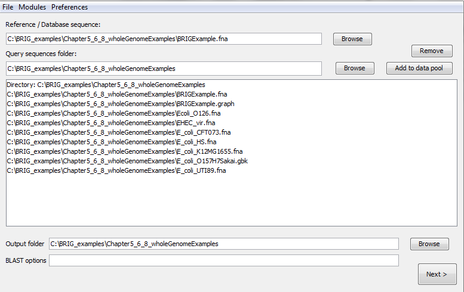
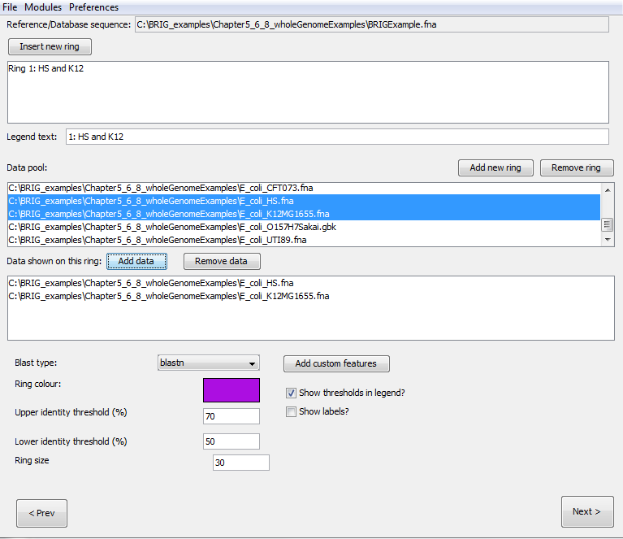
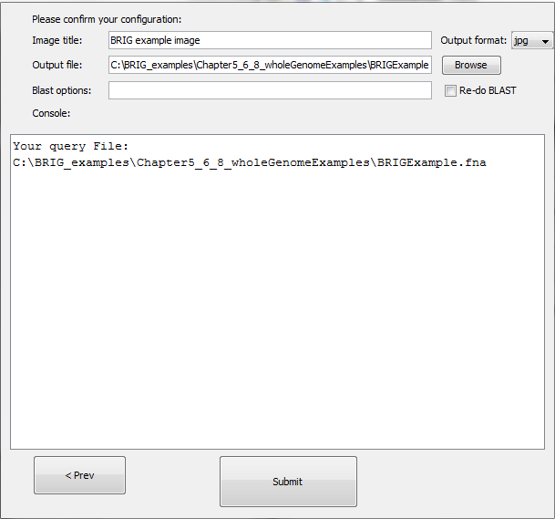

# Visualising whole genome comparisons

In this section we will walkthrough the basics of generating an image. This walkthrough will be comparing an *E. coli* genome with five other *E. coli* genomes and mapping the read coverage from the underlying genome assembly onto the same image. For this walkthrough, users will need BRIG_examples.zip, which is available from the [BRIG GitHub releases](https://github.com/happykhan/BRIG/releases). This contains all the genomes and files needed to follow along with this walkthrough. Unzip it somewhere easily accessible, like the home directory or desktop.

## About the reference genome

The reference genome used in this walkthrough is a simulated *E. coli* genome assembly. We took the published *E. coli* O157:H7 Sakai genome (Accession number BA000007) sequence and had assembly reads simulated by METASIM and then assembled these using Newbler version 2.3. The resulting contiguous sequences were ordered using Mauve against the published Sakai genome. This simulated *E. coli* is useful for illustrating some of BRIG's graphing features for assembly read coverage.

Enterohemorrhagic *E. coli* are gram-negative, enteric bacterial pathogens. They can cause diarrhea, hemorrhagic colitis, and hemolytic uremic syndrome. This particular genome we are using in this example was based on an *E. coli* O157:H7 isolated from the Sakai, Japan outbreak.

## Step 1: Load in sequences

The walkthrough will work out of the unzipped BRIG_examples.zip in the Chapter5_6_8_wholeGenomeExamples folder.

To keep the final image consistent with the walkthrough, please open "ExampleProfile.xml" from the Chapter5_6_8_wholeGenomeExamples folder. This file configures BRIG to the same image settings in the walkthrough.

1. First, set BRIGExample.fna as the reference sequence.
2. Set the Chapter5_6_8_wholeGenomeExamples folder as the query sequence folder.
3. Press "add to data pool", this should load several items into the pool list, there should be nine files.
4. Set the Chapter5_6_8_wholeGenomeExamples as the output folder.
5. The BLAST options box should be left blank.

6. Click next

!!! tip "Pro Tip 6"
    Users can add individual files to the data pool too.

## Step 2: Configure rings

The next step is to configure what information is shown on each of the concentric rings in BRIG. Create six rings, for each ring:

1. Set the legend text for each ring
2. Select the required sequences from the data pool and click on "add data" to add to the ring list.
3. Choose a colour
4. Set the upper (90) and lower (70) identity threshold.
5. Click on "add new ring" and repeat steps for each new ring required.

The values required for each ring are detailed in the table below. Notice that sequences can be collated into a single ring, like the example of K12 & HS. The ring will show BLAST matches from both HS and K12.

| Legend text | Required sequences | Colour |
|---|---|---|
| GC Content | GC Content | Ignore |
| GC Skew | GC Skew | Ignore |
| Coverage | BRIGExample.graph | 153,0,0 |
| O157:H7 | E_coli_O157H7Sakai.gbk | 0,0,153 |
| HS and K12 | E_coli_HS.fna, E_coli_K12MG1655.fna | 0,153,0 |
| CFT073 and UTI89 | E_coli_CFT073.fna, E_coli_UTI89.fna | 153,0,153 |

!!! tip "Pro Tip 7"
    Rings can be reordered by dragging them in the Ring List pane.

!!! tip "Pro Tip 8"
    You can set default threshold values in "BRIG options". See [Setting BRIG Options](configuration.md#setting-brig-options) for more details.

!!! tip "Pro Tip 9"
    When using a GenBank/EMBL file as a reference, users can choose whether to use the protein or nucleotide sequence.

## Step 3: Review and submit

The last window allows us to change the BLAST options, the location of the image file and set the image title, which will appear in the centre of the ring. For the walkthrough configure the third window as:

1. Set the image title as "BRIG example image".
2. Hit submit.
3. The image will be created in the specified output directory and should look something like Figure 7.

BRIG will format GenBank files, run BLAST, parse the results and render the image. The final image (Figure 7) shows GC Content and Skew, the Genome coverage, contig boundaries, and the BLAST results against the other *E. coli* genomes. The results for HS and K12 have been collated into a single ring, likewise for UTI89 and CFT073.

*Figure 7: The final BRIG image*

!!! tip "Pro Tip 10"
    Image settings, like size, fonts, etc can be configured in: **Main window > Preferences > Image options**.
